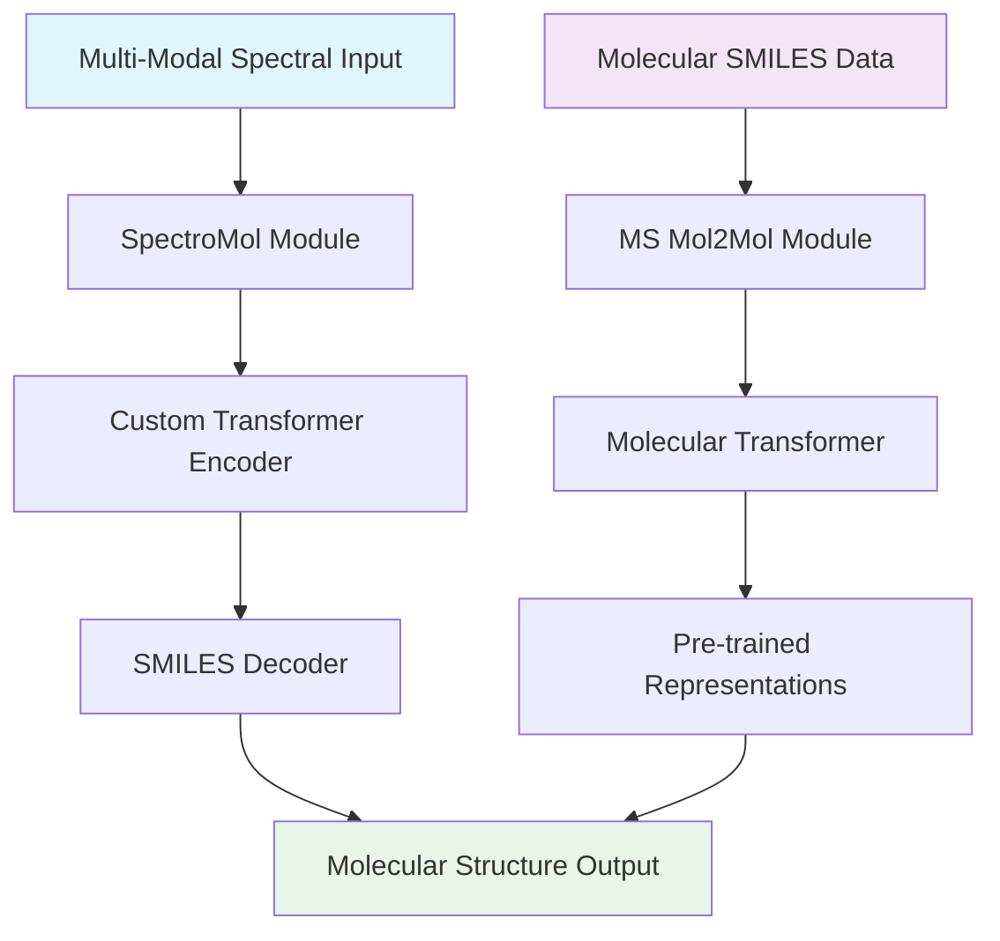

# 🧬 Multi-Spectral Molecular Structure Elucidation

<div align="center">

[](https://www.python.org/downloads/)
[](https://pytorch.org/)
[](https://opensource.org/licenses/MIT)
[](https://huggingface.co/datasets/zhiyuanyan1/multi-spec-elucidation)

*Deep Learning Framework for Molecular Structure Elucidation from Multi-Modal Spectroscopic Data*

</div>

## 🚀 Overview

This repository presents a comprehensive deep learning framework for automated molecular structure elucidation from multi-modal spectroscopic data. Our approach combines transformer-based architectures with advanced molecular representation learning to predict SMILES molecular structures from diverse analytical chemistry inputs.

### 🎯 Key Capabilities

- **Multi-Modal Spectroscopy Integration**: Seamlessly processes IR, UV-Vis, NMR (¹H, ¹³C, ¹⁹F, ¹⁵N, ¹⁷O), and high-resolution mass spectrometry data
- **Transformer-Based Architecture**: State-of-the-art attention mechanisms for complex spectral-structural relationships
- **Molecular Generation**: Autoregressive SMILES generation with constraint-guided beam search
- **Self-Supervised Learning**: Large-scale molecular pre-training with masked language modeling
- **Multi-Task Learning**: Joint optimization of structure prediction and chemical property estimation

## 🏗️ Architecture

<div align="center">



</div>

## 📁 Project Structure

### 🔬 [SpectroMol](./spectromol/) - Multi-Modal Spectral Analysis
Advanced deep learning framework for molecular structure prediction from diverse spectroscopic data.

**Core Components:**
- **Multi-Modal Encoder**: Custom transformer architecture for spectral feature processing
- **SMILES Decoder**: Autoregressive molecular structure generation
- **Auxiliary Tasks**: Joint learning of chemical properties and molecular descriptors
- **Attention Analysis**: Interpretable spectral-structural relationships

**Key Features:**
- 8 spectroscopic modalities (IR, UV, ¹H/¹³C NMR, HSQC, COSY, J-coupling, MS)
- Temperature-controlled sampling and beam search
- Comprehensive evaluation metrics (BLEU, fingerprint similarity, validity)
- Robustness analysis and t-SNE visualization

### 🧪 [MS Mol2Mol](./ms_mol2mol/) - Molecular Representation Learning
Self-supervised molecular transformer for large-scale chemical understanding and generation.

**Core Components:**
- **Pre-training Framework**: Masked language modeling on molecular sequences
- **Fine-tuning System**: Task-specific adaptation with SMILES corruption
- **Inference Engine**: Constraint-guided molecular generation
- **Mass Spectrometry Integration**: Enhanced molecular understanding with MS data

**Key Features:**
- Transformer encoder-decoder with atomic feature integration
- Advanced tokenization for complex molecular structures
- Distributed training with gradient accumulation
- Beam search and temperature sampling strategies


## 📃 Datasets

This project utilizes comprehensive datasets hosted on Hugging Face, providing both molecular pre-training data and multi-modal spectroscopic datasets for structure elucidation tasks.

### 🗃️ Dataset Collection
**Main Dataset Hub**: [multi-spec-elucidation](https://huggingface.co/datasets/zhiyuanyan1/multi-spec-elucidation)

Our dataset collection includes two primary components:

#### 🧪 MS Mol2Mol Pre-training Dataset
- **Repository**: [ms-mol2mol](https://huggingface.co/datasets/zhiyuanyan1/multi-spec-elucidation/tree/main/ms-mol2mol)
- **Content**: Large-scale molecular dataset containing 400M molecules for self-supervised pre-training
- **Purpose**: Molecular representation learning and transformer pre-training
- **Format**: SMILES sequences with molecular properties and descriptors
- **Applications**: Foundation model development, molecular understanding, and chemical space exploration

#### 🔬 SpectroMol QM9 Spectral Dataset
- **Repository**: [qm9_all_raw_spe](https://huggingface.co/datasets/zhiyuanyan1/multi-spec-elucidation/tree/main/qm9_all_raw_spe)
- **Content**: Comprehensive multi-modal spectroscopic data derived from QM9 molecules
- **Modalities**: IR, UV-Vis, NMR (¹H, ¹³C, ¹⁹F, ¹⁵N, ¹⁷O), and mass spectrometry data
- **Purpose**: Training and evaluation of multi-modal structure elucidation models
- **Format**: Processed spectral features paired with ground-truth SMILES structures
- **Applications**: Multi-modal learning, spectral-structural relationship modeling, and analytical chemistry AI

### 📥 Data Access
```bash
# Download datasets using Hugging Face datasets library
from datasets import load_dataset

# Load MS Mol2Mol pre-training data
ms_mol2mol_dataset = load_dataset("zhiyuanyan1/multi-spec-elucidation", data_dir="ms-mol2mol")

# Load SpectroMol QM9 spectral data
spectromol_dataset = load_dataset("zhiyuanyan1/multi-spec-elucidation", data_dir="qm9_all_raw_spe")
```


## 🛠️ Installation

### Prerequisites
```bash
# Core dependencies
Python >= 3.8
PyTorch >= 1.9.0
RDKit >= 2021.03
NumPy >= 1.21.0
Pandas >= 1.3.0
```

### Environment Setup
```bash
# Clone repository
git clone https://github.com/your-repo/multi-spec-elucidation.git
cd multi-spec-elucidation

# Create conda environment
conda create -n mol-elucidation python=3.8
conda activate mol-elucidation

# Install PyTorch (adjust CUDA version as needed)
conda install pytorch torchvision torchaudio pytorch-cuda=11.8 -c pytorch -c nvidia

# Install RDKit
conda install -c rdkit rdkit

# Install additional dependencies
pip install -r requirements.txt
```

## 🚀 Quick Start

### High-level Usage of SpectroMol: Multi-Modal Structure Prediction

```python
from spectromol import AtomPredictionModel, predict_greedy

# Initialize model
model = AtomPredictionModel(
    vocab_size=vocab_size,
    count_tasks_classes=count_tasks,
    binary_tasks=binary_tasks
)

# Load pre-trained weights
model.load_state_dict(torch.load('spectromol/weights/best_model.pth'))

# Predict molecular structures from spectra
predicted_smiles = predict_greedy(
    model, ir_data, uv_data, cnmr_data, hnmr_data, mass_data,
    char2idx, idx2char, max_seq_length=100
)
```

### High-level Usage of MS-Mol2Mol: Pre-training and Fine-tuning

```python
from ms_mol2mol import MoleculePretrainingModel, train_model

# Pre-training on large molecular datasets
pretrain_model = MoleculePretrainingModel(
    vocab_size=vocab_size,
    atom_type_dim=6,
    d_model=512,
    nhead=8
)

# Self-supervised pre-training
train_model(pretrain_model, pretrain_dataloader, epochs=100)

# Fine-tuning for specific tasks
finetune_model(pretrain_model, task_dataloader, epochs=50)
```

---

<div align="center">

**🧬 Advancing Molecular Discovery Through AI 🤖**

*Built with ❤️ for the scientific community*

</div>
