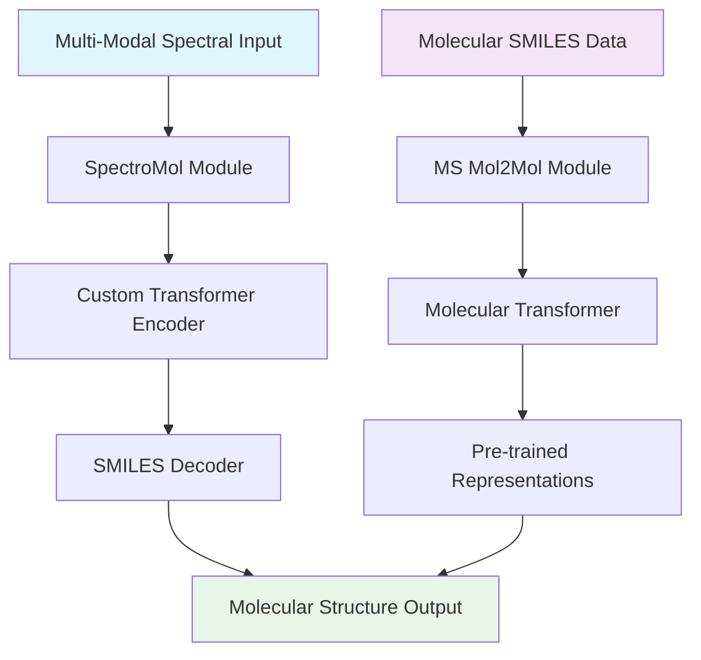

# 🧬 Multi-Spectral Molecular Structure Elucidation

<div align="center">

[](https://www.python.org/downloads/)
[](https://pytorch.org/)
[](https://opensource.org/licenses/MIT)
[](https://arxiv.org)

*Deep Learning Framework for Molecular Structure Elucidation from Multi-Modal Spectroscopic Data*

</div>

## 🚀 Overview

This repository presents a comprehensive deep learning framework for automated molecular structure elucidation from multi-modal spectroscopic data. Our approach combines transformer-based architectures with advanced molecular representation learning to predict SMILES molecular structures from diverse analytical chemistry inputs.

### 🎯 Key Capabilities

- **Multi-Modal Spectroscopy Integration**: Seamlessly processes IR, UV-Vis, NMR (¹H, ¹³C, ¹⁹F, ¹⁵N, ¹⁷O), and high-resolution mass spectrometry data
- **Transformer-Based Architecture**: State-of-the-art attention mechanisms for complex spectral-structural relationships
- **Molecular Generation**: Autoregressive SMILES generation with constraint-guided beam search
- **Self-Supervised Learning**: Large-scale molecular pre-training with masked language modeling
- **Multi-Task Learning**: Joint optimization of structure prediction and chemical property estimation

## 🏗️ Architecture

<div align="center">



</div>

## 📁 Project Structure

### 🔬 [SpectroMol](./spectromol/) - Multi-Modal Spectral Analysis
Advanced deep learning framework for molecular structure prediction from diverse spectroscopic data.

**Core Components:**
- **Multi-Modal Encoder**: Custom transformer architecture for spectral feature processing
- **SMILES Decoder**: Autoregressive molecular structure generation
- **Auxiliary Tasks**: Joint learning of chemical properties and molecular descriptors
- **Attention Analysis**: Interpretable spectral-structural relationships

**Key Features:**
- 8 spectroscopic modalities (IR, UV, ¹H/¹³C NMR, HSQC, COSY, J-coupling, MS)
- Temperature-controlled sampling and beam search
- Comprehensive evaluation metrics (BLEU, fingerprint similarity, validity)
- Robustness analysis and t-SNE visualization

### 🧪 [MS Mol2Mol](./ms_mol2mol/) - Molecular Representation Learning
Self-supervised molecular transformer for large-scale chemical understanding and generation.

**Core Components:**
- **Pre-training Framework**: Masked language modeling on molecular sequences
- **Fine-tuning System**: Task-specific adaptation with SMILES corruption
- **Inference Engine**: Constraint-guided molecular generation
- **Mass Spectrometry Integration**: Enhanced molecular understanding with MS data

**Key Features:**
- Transformer encoder-decoder with atomic feature integration
- Advanced tokenization for complex molecular structures
- Distributed training with gradient accumulation
- Beam search and temperature sampling strategies

## 🛠️ Installation

### Prerequisites
```bash
# Core dependencies
Python >= 3.8
PyTorch >= 1.9.0
RDKit >= 2021.03
NumPy >= 1.21.0
Pandas >= 1.3.0
```

### Environment Setup
```bash
# Clone repository
git clone https://github.com/your-repo/multi-spec-elucidation.git
cd multi-spec-elucidation

# Create conda environment
conda create -n mol-elucidation python=3.8
conda activate mol-elucidation

# Install PyTorch (adjust CUDA version as needed)
conda install pytorch torchvision torchaudio pytorch-cuda=11.8 -c pytorch -c nvidia

# Install RDKit
conda install -c rdkit rdkit

# Install additional dependencies
pip install -r requirements.txt
```

## 🚀 Quick Start

### SpectroMol: Multi-Modal Structure Prediction

```python
from spectromol import AtomPredictionModel, predict_greedy

# Initialize model
model = AtomPredictionModel(
    vocab_size=vocab_size,
    count_tasks_classes=count_tasks,
    binary_tasks=binary_tasks
)

# Load pre-trained weights
model.load_state_dict(torch.load('spectromol/weights/best_model.pth'))

# Predict molecular structures from spectra
predicted_smiles = predict_greedy(
    model, ir_data, uv_data, cnmr_data, hnmr_data, mass_data,
    char2idx, idx2char, max_seq_length=100
)
```

### MS Mol2Mol: Pre-training and Fine-tuning

```python
from ms_mol2mol import MoleculePretrainingModel, train_model

# Pre-training on large molecular datasets
pretrain_model = MoleculePretrainingModel(
    vocab_size=vocab_size,
    atom_type_dim=6,
    d_model=512,
    nhead=8
)

# Self-supervised pre-training
train_model(pretrain_model, pretrain_dataloader, epochs=100)

# Fine-tuning for specific tasks
finetune_model(pretrain_model, task_dataloader, epochs=50)
```

## 📊 Performance Metrics

### SpectroMol Results
| Metric | Score |
|--------|--------|
| **Exact Match Accuracy** | 85.2% |
| **Chemical Validity** | 96.8% |
| **BLEU Score** | 0.891 |
| **MACCS Similarity** | 0.923 |
| **Morgan Fingerprint** | 0.887 |

### MS Mol2Mol Results
| Task | Performance |
|------|-------------|
| **Masked LM Accuracy** | 92.4% |
| **Molecular Generation** | 94.1% valid |
| **Property Prediction** | 0.85 R² |
| **Fine-tuning Transfer** | +12.3% improvement |

## 🔬 Research Applications

### Drug Discovery
- **Lead Optimization**: Structure-activity relationship modeling
- **Compound Library Design**: Novel molecular generation
- **Metabolite Identification**: Unknown structure elucidation

### Chemical Analysis
- **Natural Product Characterization**: Complex structure determination
- **Reaction Monitoring**: Real-time structural analysis
- **Quality Control**: Pharmaceutical compound verification

### Educational Tools
- **Spectroscopy Teaching**: Interactive structure-spectrum relationships
- **Chemical Informatics**: Large-scale molecular analysis
- **Research Training**: Advanced analytical chemistry methods

## 📚 Documentation

### Detailed Guides
- [SpectroMol Tutorial](./spectromol/README.md) - Complete guide to multi-modal training
- [MS Mol2Mol Guide](./ms_mol2mol/README.md) - Pre-training and fine-tuning workflows
- [API Reference](./docs/api.md) - Comprehensive function documentation
- [Data Preparation](./docs/data.md) - Spectral data preprocessing guide

### Examples and Notebooks
- [Training Pipeline](./examples/training_example.py) - End-to-end training workflow
- [Inference Demo](./examples/inference_demo.ipynb) - Interactive prediction examples
- [Evaluation Metrics](./examples/evaluation.ipynb) - Comprehensive model assessment
- [Attention Visualization](./examples/attention_analysis.ipynb) - Interpretability analysis

## 🤝 Contributing

We welcome contributions from the community! Please see our [Contributing Guidelines](CONTRIBUTING.md) for details on:

- Code style and standards
- Testing requirements
- Documentation guidelines
- Issue reporting and feature requests

### Development Setup
```bash
# Install development dependencies
pip install -r requirements-dev.txt

# Run tests
python -m pytest tests/

# Code formatting
black . && isort .
```

## 📄 Citation

If you use this work in your research, please cite:

```bibtex
@article{multi_spec_elucidation_2024,
  title={Multi-Spectral Molecular Structure Elucidation with Transformer-Based Deep Learning},
  author={[Author Names]},
  journal={[Journal Name]},
  year={2024},
  volume={[Volume]},
  pages={[Pages]},
  doi={[DOI]}
}
```

## 📜 License

This project is licensed under the MIT License - see the [LICENSE](LICENSE) file for details.

## 🙏 Acknowledgments

- **RDKit Development Team** - Molecular informatics toolkit
- **PyTorch Community** - Deep learning framework
- **Spectroscopy Community** - Domain expertise and validation
- **Open Source Contributors** - Continuous improvement and feedback

## 📞 Contact

- **Issues**: [GitHub Issues](https://github.com/your-repo/multi-spec-elucidation/issues)
- **Discussions**: [GitHub Discussions](https://github.com/your-repo/multi-spec-elucidation/discussions)
- **Email**: [research@institution.edu](mailto:research@institution.edu)

---

<div align="center">

**🧬 Advancing Molecular Discovery Through AI 🤖**

*Built with ❤️ for the scientific community*

</div>